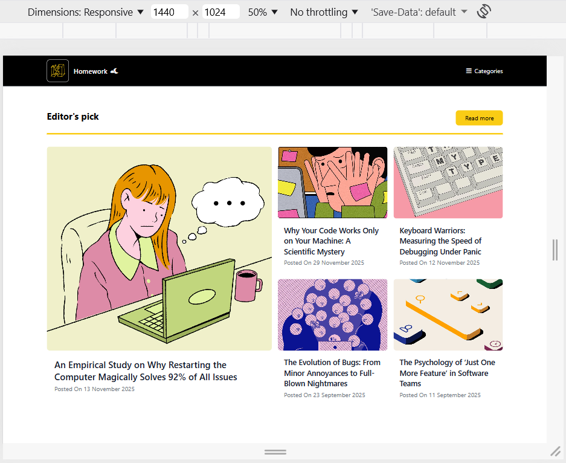
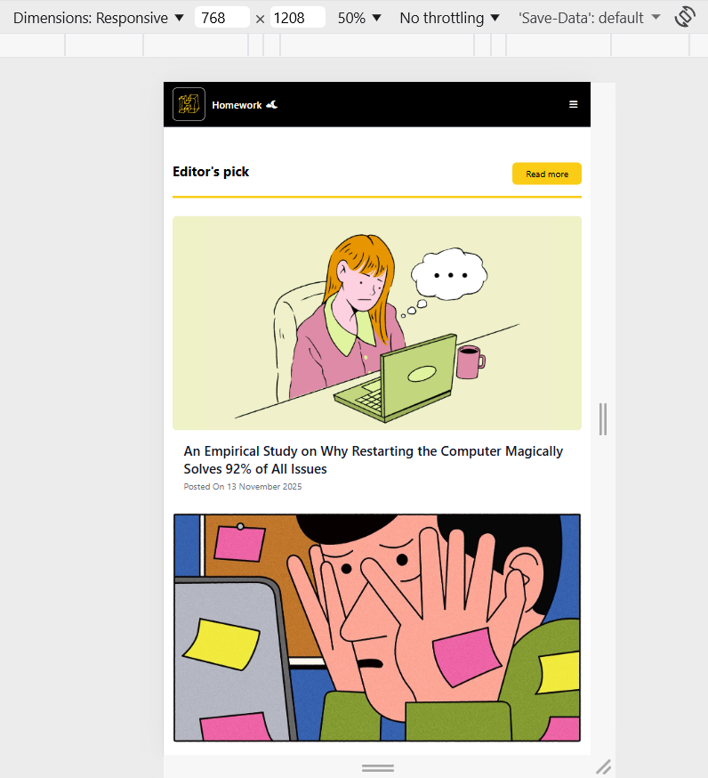
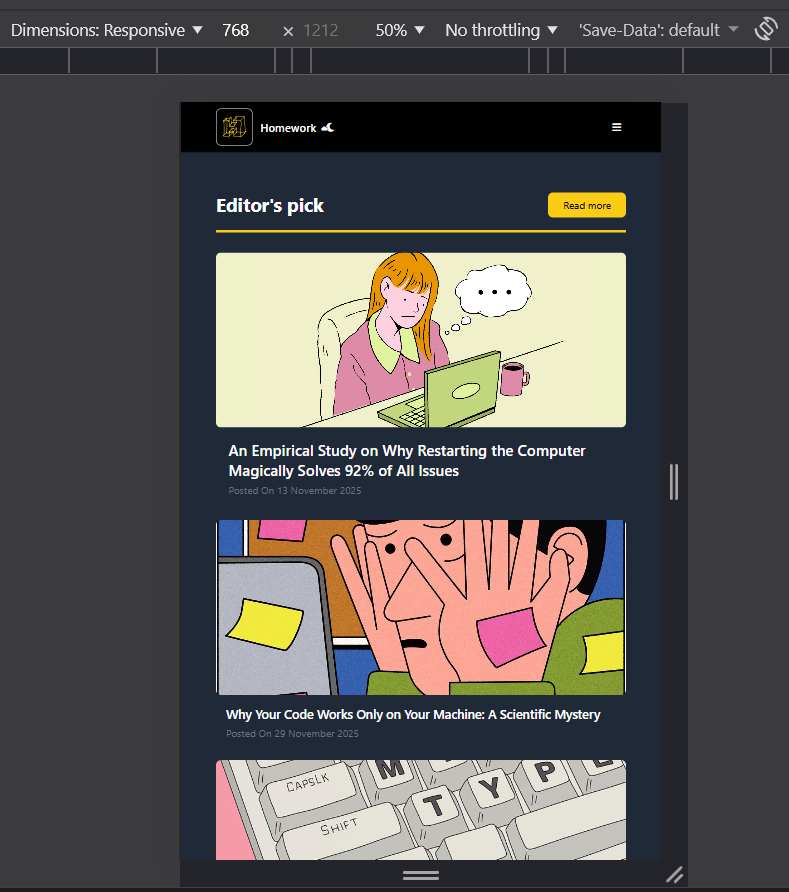

# Homework Design Bootcamp

## MiSSION B: ARTICLE SITE
* รองรับ DESKTOP / IPAD 
* Darkmode 
## Layout requirements
* Desktop: grid layout (e.g., 3 columns for cards or a featured section + grid)
* iPad: 1–2 columns, stacked depending on the chosen sub-layout

## CREATOR
* นายพัชรพล โยริยะ (เบสท์)

## IMAGE

LIGHTMODE
* DESKTOP  
  
* IPAD  
  

DARKMODE
* DESKTOP  
  
* IPAD  
  